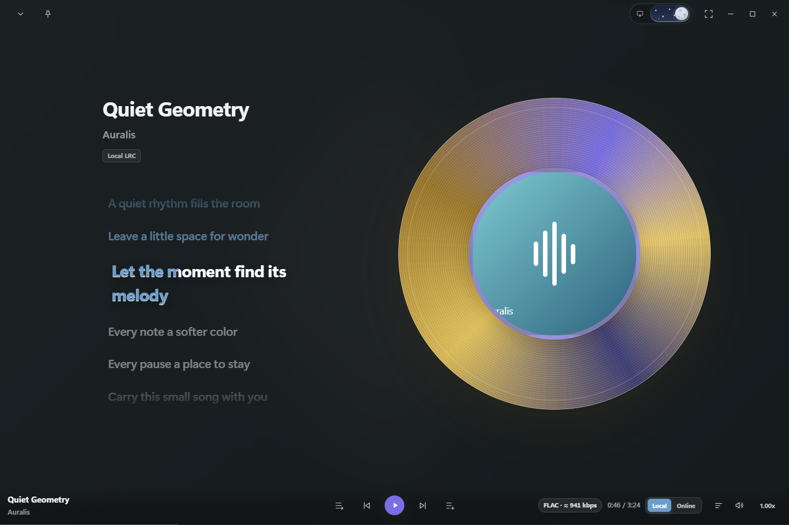
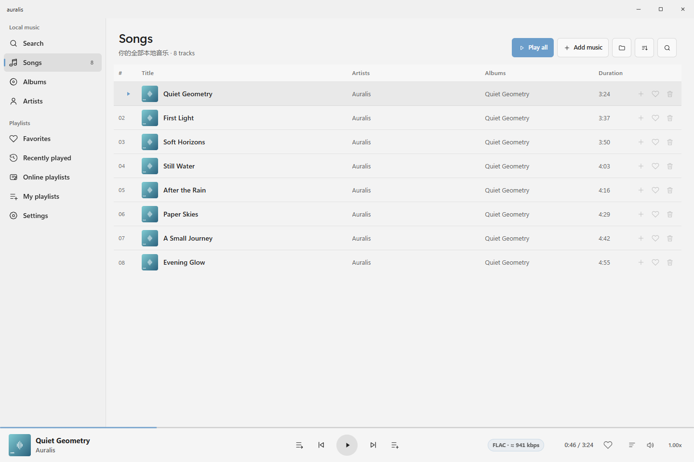
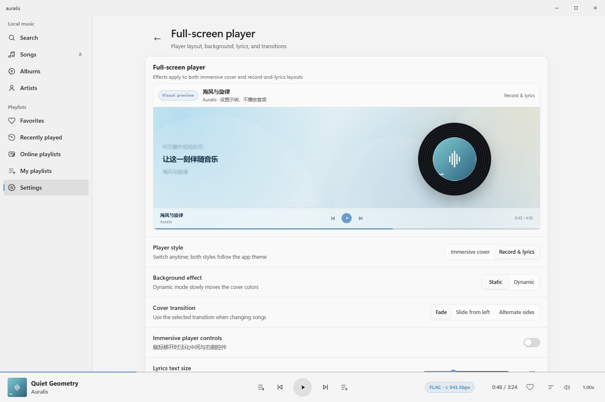

<p align="center"></p>
<h1 align="center">Auralis</h1>
<p align="center">A Fluent-inspired Windows music player, built around listening.</p>
<p align="center">Local library · Immersive playback pages · Synchronized lyrics · Modular playback</p>
<p align="center"><strong>English</strong> · <a href="README.zh-CN.md">简体中文</a></p>
<p align="center"><a href="https://zch-czc.github.io/winplayer/">Explore the interactive Auralis showcase</a></p>



**Your music, with room to breathe.** Auralis combines an organized local library with an immersive player, expressive artwork, and lyrics that follow the music. A consistent Fluent-inspired interface connects browsing, listening, and customization—without turning everyday playback into a setup project.

> The images below render the actual application UI with original demonstration tracks, artwork, lyrics, and sample quality data. They are not native-window captures or evidence of audio playback, decoding, or sound quality. See [screenshot notes](docs/screenshots/README.md).

## At a glance

- **A library you own:** browse local songs, albums, and artists; search your collection; keep favorites, recent listening history, and personal playlists.
- **Two ways to settle into the music:** choose an artwork-focused immersive player or a record-and-lyrics layout.
- **One consistent playback session:** the library bar and expanded player share track information, transport controls, playback mode, and audio details.
- **Lyrics where you need them:** follow timestamped local LRC lyrics, adjust timing, or use a separate desktop lyric window.
- **A Fluent-inspired desktop experience:** light, dark, and system themes, accent colors, restrained surfaces, side drawers, and motion preferences.
- **Useful audio information:** read the available format and bitrate, with sample rate, bit depth, and channels in the quality tooltip.
- **Windows integration:** media keys, system media controls, optional tray behavior, single-instance operation, and high-DPI support.
- **A modular foundation:** playback and transport have dedicated component contracts; a default backend is included for everyday listening.

## Explore the interface

### A clear library, with playback always within reach



The library keeps navigation on the left, your collection in the main content area, and the current playback session at the bottom. Titles, artists, albums, and durations form a readable track list; artwork adds a visual anchor without replacing the information you need.

Use the Songs, Albums, and Artists views to browse in different ways. Search narrows down your collection, Favorites brings frequently played tracks closer, Recently played helps you return to something you just heard, and My playlists gives you a place to arrange your own selections.

The bottom bar stays available while you browse. It brings together the current track, play/pause, previous and next, playback mode, progress, volume, speed, and queue access. Opening another page does not create a separate playback session.

### Two immersive playback layouts

Open the expanded player from the current-track area in the bottom bar. Both layouts use the same playback state and controls:

| Layout | Visual focus | Listening experience |
| --- | --- | --- |
| **Immersive cover** | Prominent album artwork and a coordinated background | A cover-focused view with space for track information and lyrics |
| **Record and lyrics** | A record-style visual alongside the lyric column | A balanced layout for following the words while keeping the artwork in view |

Record motion follows playback and respects reduced-motion settings. Ordinary square artwork is not treated as a continuously spinning record.

The expanded player is an in-app view, not a second player window. Windows full-screen mode is a separate setting: use **F11** when you want the application window to fill the display.

### A queue that stays beside the music

The playback queue opens as a right-side drawer, including inside the expanded player. Review upcoming tracks and adjust the queue without leaving the listening view. Drawer and dialog interactions retain keyboard focus behavior, and dismissible panels can be closed with Escape.

Playback mode is shared between the bottom bar and expanded player. Choose normal progression, repeat all, repeat one, or shuffle; the two sets of controls describe the same session rather than maintaining independent modes.

### Lyrics with practical controls

Auralis supports local timestamped **LRC** lyrics and plain-text **TXT** lyrics. Timestamped lines follow the current playback position; plain text remains readable without inventing synchronization data.

- Select a local lyric file from the current track's lyric options.
- Adjust the lyric timing offset when the words arrive ahead of or behind the music.
- Tune lyric presentation in the player settings.
- Enable a separate floating desktop lyric display when the main window is not your focus.

Line-level highlighting does not imply word-level timestamps. Synchronization depends on the timing information present in the lyric file.

## Make the player yours



Player customization places the layout, background, cover transitions, and lyric presentation together with a visual preview. Compare a configuration before returning to your music. The preview uses demonstration content; it does not start audio, replace your queue, or change the current track.

### Appearance and motion

- **Theme:** choose light, dark, or follow the Windows appearance.
- **Accent:** select an accent color to connect controls and highlights throughout the interface.
- **Background:** choose supported window effects or a custom image, and adjust the expanded player's background presentation.
- **Navigation:** use the compact sidebar preference when you want more room for content.
- **Motion:** use full, reduced, or system-following motion preferences. Transitions have a reduced-motion path.
- **Input:** navigate with Tab / Shift+Tab and activate focused buttons with Enter / Space; review playback shortcuts in Settings.

Native Mica and other window materials depend on Windows support. Unsupported Mica configurations fall back to a solid surface. Blur and color treatments inside the WebView are visual effects, not a claim that every surface is native Mica.

## Audio controls and information

### More than a “lossless” label

The bottom bar and expanded player share the current quality information. The label shows available format and bitrate information; its tooltip can include **sample rate, bit depth, and channel count**.

For a complete FLAC file, Auralis can calculate **average encoded bitrate excluding metadata**, marked with “≈”. This is not instantaneous bitrate and is not the theoretical bandwidth of uncompressed PCM. Other formats use information available from the playback backend. Missing fields are left unknown rather than filled with guessed values.

The quality numbers in documentation screenshots are illustrative, not measurements of a file being played.

### Choose how audio reaches your device

Audio settings expose the output backend, output device, channel configuration, and playback buffer. A larger buffer may tolerate more delivery jitter at the cost of slower reactions when switching tracks or seeking. Backend changes may take effect on the next track.

Device and decoder capabilities still matter. Displaying a file's sample rate or bit depth does not guarantee that the Windows output path preserves that format unchanged, and the application does not promise bit-perfect output or DSD passthrough.

## At home on Windows

Auralis keeps desktop behavior configurable rather than making every integration mandatory:

- **Single instance:** opening the application again returns to the existing instance.
- **System media controls and media keys:** control playback without first navigating back to the library.
- **Tray behavior:** optionally keep music playing when the main window is closed; use the tray exit command for a full shutdown.
- **Startup:** optionally launch the player when signing in to Windows.
- **Taskbar integration:** enable the supported taskbar music experience from Settings; availability depends on the Windows environment.
- **Window behavior:** native resizing, full-screen mode, and per-monitor DPI handling remain part of the desktop shell.

### Optional browser playback on your local network

The LAN player lets a paired browser play music from the local library with its **own playback queue**, without taking over the desktop session. It is disabled by default and uses time-limited pairing links.

Use it only on a trusted private network. Media is served over HTTP, not encrypted HTTPS; do not expose the service through public Wi-Fi, port forwarding, or an untrusted network.

## Modular playback, without mandatory assembly

Auralis separates the playback page from the mechanism that plays media. The application owns the interface, library, queue, and interaction. A playback component owns the media session; transport components handle media access through their own contract.

**The default playback backend is bundled.** You do not need to find or install a component before listening to local music.

For optional replacement components:

1. Open component management in Settings and review the relevant component type.
2. Import a compatible package through its dedicated entry point.
3. Review its identity and capabilities, explicitly approve trust, and enable it.
4. Restart when prompted to apply the change. Restarting stops current playback.

Playback components use dedicated `.auralis-playback.zip` packages. Package types are not interchangeable. Componentization is an implementation boundary—not a promise that a plugin can arbitrarily replace playback-page layouts.

Only install components you trust. They run inside the player process, **not a security sandbox**. An integrity checksum does not establish publisher trust. The current interface does not offer graphical uninstall or rollback controls.

## Get started

1. Choose **Add music** on the Songs page, or manage music folders in Settings.
2. Select a track and control playback from the bottom bar.
3. Click the current-track area to open the expanded player.
4. Visit the full-screen player settings to choose a layout, and Appearance to select a theme.
5. Organize favorites and playlists, or open the queue to adjust what plays next.

Read the [user guide](docs/USER_GUIDE.en-US.md) for everyday controls and troubleshooting.

This repository contains source code. A source upload is not an installable release; use only a signed package explicitly published by the project, or build the application yourself. Self-signed test packages are not a publicly trusted production release.

## Build and verify

Requirements: **Windows 10/11**, **.NET 8 SDK**, and **WebView2 Runtime**.

```powershell
dotnet restore Auralis.sln
dotnet build Auralis.sln -c Release --no-restore
dotnet run --project Auralis.Tests -c Release
dotnet run --project Auralis.Platform.Host.Tests -c Release
```

For interface development tests, install **Node.js 20+** and **Microsoft Edge**:

```powershell
npm ci --ignore-scripts
npm run test:logic
npm run test:ui
```

Development dependencies are not shipped in the player. Browser checks use isolated profiles and demonstration data; they do not access personal browser profiles and do not replace native-window, real audio-output, or multi-monitor acceptance testing.

## Contributing and license

Read [AGENTS.md](AGENTS.md) before contributing. The source is licensed under the [MIT License](LICENSE). Dependencies retain their respective licenses; see [third-party notices](packaging/THIRD-PARTY-NOTICES.txt). Artwork and icon provenance is recorded in the [asset notes](Auralis/Assets/README.md).
