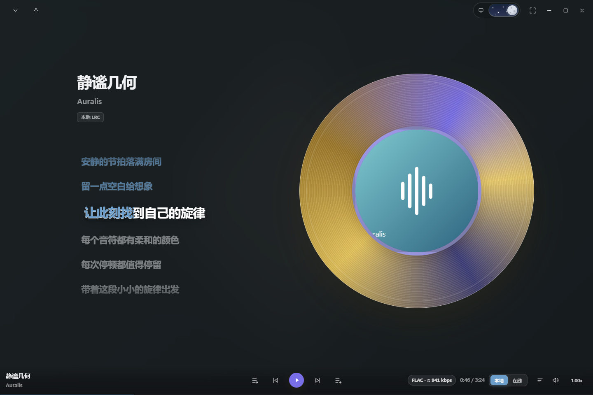
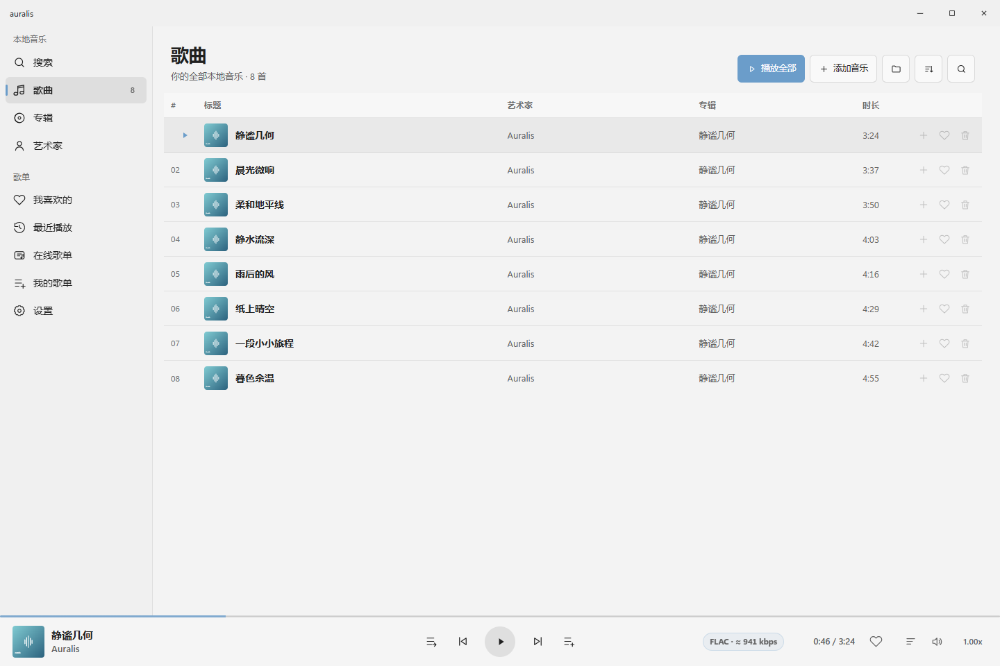
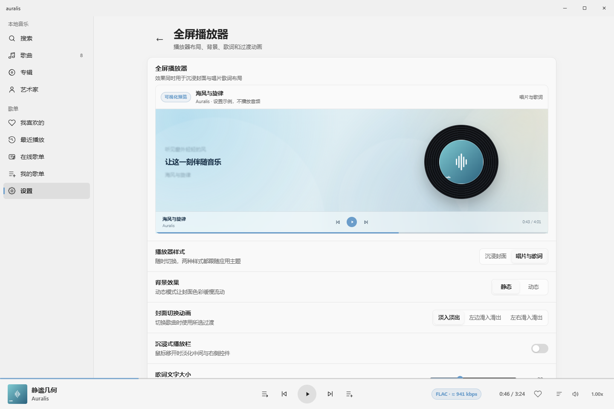

<p align="center"></p>
<h1 align="center">Auralis</h1>
<p align="center">一款专注聆听体验的 Windows Fluent 播放器。</p>
<p align="center">本地音乐库 · 沉浸式播放页 · 同步歌词 · 模块化播放</p>
<p align="center"><a href="README.md">English</a> · <strong>简体中文</strong></p>



**让音乐成为主角。** Auralis 将清晰的本地曲库、沉浸式播放页、专辑视觉与同步歌词结合起来。从浏览、聆听到个性化设置，保持一致的 Fluent 风格交互，基本播放不需要用户先组装一套组件。

> 图片由实际应用界面资源渲染，使用原创演示曲目、封面、歌词及示例音质数据；不是原生窗口截图，也不用于证明实际音频播放、解码或音质。见[截图说明](docs/screenshots/README.md)。

## 功能概览

- **自己的本地曲库**：按歌曲、专辑、艺术家浏览，搭配搜索、收藏、最近播放与自建歌单。
- **两种沉浸布局**：选择突出专辑视觉的“沉浸封面”，或适合跟随歌词的“唱片与歌词”。
- **同一个播放会话**：底部播放栏与展开播放器共用曲目、控制、播放模式及音质信息。
- **按需呈现歌词**：同步本地 LRC 歌词、调整时间偏移，或开启独立桌面歌词。
- **Fluent 风格桌面体验**：浅色、深色、系统主题，主题色、侧边抽屉与动画偏好。
- **实用音频信息**：显示可获得的格式和码率，悬停查看采样率、位深与声道。
- **Windows 集成**：媒体键、系统媒体控制、可选托盘行为、单实例与高 DPI 支持。
- **模块化播放基础**：播放与传输使用独立组件契约，默认后端随应用提供。

## 认识界面

### 曲库清晰，播放控制始终在手边



左侧是导航，中间是曲库内容，底部是当前播放会话。歌曲名称、艺术家、专辑和时长形成清楚的信息层级；封面辅助识别，不取代必要的文字信息。

“歌曲”“专辑”“艺术家”提供不同浏览方式；搜索用于缩小范围，“我喜欢的”收集常听曲目，“最近播放”帮助找回刚听过的内容，“我的歌单”便于按自己的习惯整理音乐。

底部播放栏集中当前曲目、播放/暂停、上一首/下一首、播放模式、进度、音量、速度与队列入口。浏览其它页面不会创建新的播放会话。

### 两种沉浸式播放布局

点击底部当前曲目信息展开播放器，两种布局共用同一套状态与控制：

| 布局 | 视觉重点 | 聆听体验 |
| --- | --- | --- |
| **沉浸封面** | 大幅专辑封面与协调的背景 | 突出专辑视觉，同时保留曲目信息与歌词空间 |
| **唱片与歌词** | 唱片视觉与并列的歌词区域 | 兼顾封面与歌词，适合边听边读 |

唱片动画跟随播放状态，并遵循减少动画偏好；普通方形封面不会被当作唱片持续旋转。

展开播放器是应用内部页面，不是第二个播放窗口。Windows 全屏是另一个状态，需要填满显示器时可使用 **F11**。

### 队列在音乐旁边展开

播放队列采用右侧抽屉，在展开播放器内同样可用。查看后续曲目、调整队列都无需离开当前聆听页面。抽屉和弹窗保留键盘焦点处理，可关闭的面板支持 Escape。

底部播放栏与展开播放器共享播放模式：正常顺序、列表循环、单曲循环与随机播放。两处按钮描述同一个会话，不各自维护独立模式。

### 歌词不仅是显示文字

支持带时间戳的本地 **LRC** 和纯文本 **TXT**。LRC 可按当前播放时间高亮对应行；纯文本保持可读，不虚构同步信息。

- 从当前歌曲的歌词选项中选择本地歌词文件。
- 通过歌词时间偏移校正提前或延后的文字。
- 在播放器设置中调整歌词呈现。
- 需要离开主窗口时，可启用独立浮动的桌面歌词。

行级同步不等于逐字时间戳；同步效果取决于文件包含的时间信息。

## 按你的习惯调整



布局、背景、封面过渡与歌词设置集中在同一页，配有可视化预览。先比较配置，再回到自己的音乐。预览使用演示内容，不播放音频、不替换队列，也不会切换当前歌曲。

### 外观与动画

- **主题**：浅色、深色或跟随 Windows。
- **主题色**：使用选定颜色统一控制与高亮反馈。
- **背景**：选择受支持的窗口效果或自定义图片，并调整展开播放器的背景表现。
- **导航**：可使用紧凑侧边栏，为内容留出更多空间。
- **动画**：完整、减少或跟随系统；过渡具有减少动画路径。
- **输入**：Tab / Shift+Tab 导航，Enter / Space 操作焦点按钮；播放快捷键可在设置中查看。

原生云母等窗口材质依赖 Windows 支持；不支持云母时回退到实色。WebView 内容层的模糊与色彩效果不等于原生云母。

## 音频控制与信息

### 不止一个“无损”标签

底部播放栏和展开播放器共用音质信息。标签显示可获得的格式与码率，悬停说明还可包含**采样率、位深及声道数**。

对于完整 FLAC 文件，可计算排除元数据后的**平均编码码率**，以“≈”标记。这不是瞬时码率，也不是未压缩 PCM 的理论带宽。其它格式使用播放后端实际提供的信息，未知字段不会填入猜测值。

文档截图中的音质数值仅用于界面演示，不是正在播放文件的测量结果。

### 选择音频如何输出

音频设置提供输出后端、输出设备、声道配置及播放缓冲。较大的缓冲有助于抵抗传输抖动，但切歌和拖动进度的反应可能更慢。后端变更可能在下一首生效。

实际能力仍取决于设备与解码器。显示文件采样率或位深，不代表 Windows 输出链路会原样保留这些参数；应用不承诺 bit-perfect 输出或 DSD 直通。

## 贴合 Windows

桌面集成可以按需设置，而不是全部强制开启：

- **单实例**：再次打开应用时回到已有实例。
- **系统媒体控制与媒体键**：无需回到曲库即可操作播放。
- **托盘行为**：可在关闭主窗口后继续播放；完全退出使用托盘退出命令。
- **开机启动**：可选择登录 Windows 时启动。
- **任务栏集成**：在设置中开启受支持的任务栏音乐体验，实际可用性取决于系统环境。
- **窗口行为**：保留原生缩放、全屏及每显示器 DPI 处理。

### 可选的局域网浏览器播放

局域网播放器允许配对浏览器访问本地曲库，使用**独立播放队列**，不接管桌面播放会话。功能默认关闭，采用限时配对链接。

仅用于可信私人网络。音频通过 HTTP 传输，不是加密 HTTPS；请勿在公共 Wi-Fi、端口映射或不可信网络中暴露该服务。

## 模块化播放，不强制用户组装

Auralis 将播放页面与实际播放机制分开：应用负责界面、曲库、队列与交互；播放组件负责媒体会话，传输组件通过独立契约处理媒体访问。

**默认播放后端随软件提供。** 播放本地音乐不需要先寻找或安装组件。

需要可选替代组件时：

1. 在设置中打开组件管理，确认组件类型。
2. 使用对应专用入口导入兼容包。
3. 检查身份与能力，主动确认信任并启用。
4. 按提示重启以应用变更；重启会停止当前播放。

播放组件使用专用的 `.auralis-playback.zip` 包，不同类型不能混用。组件化是实现职责的划分，不代表插件可以任意替换播放页布局。

只安装可信组件。组件运行于播放器进程，**不是安全沙箱**；完整性校验不能证明发布者可信。当前界面没有图形卸载或回滚入口。

## 开始使用

1. 在歌曲页选择“添加音乐”，或在设置中管理音乐文件夹。
2. 选择曲目，通过底部播放栏控制播放。
3. 点击当前曲目信息展开播放器。
4. 在全屏播放器设置中选择布局，在外观设置中选择主题。
5. 整理收藏与歌单，或打开队列调整接下来的曲目。

更多操作和排查方法见[中文使用指南](docs/USER_GUIDE.zh-CN.md)。

当前仓库提供源码。源码上传不等于已有可安装的正式发行版；请仅使用项目明确发布的已签名安装包，或自行构建。自签名测试包不代表正式受信任的生产发行版。

## 构建与验证

环境：**Windows 10/11**、**.NET 8 SDK**、**WebView2 Runtime**。

```powershell
dotnet restore Auralis.sln
dotnet build Auralis.sln -c Release --no-restore
dotnet run --project Auralis.Tests -c Release
dotnet run --project Auralis.Platform.Host.Tests -c Release
```

界面开发测试需要 **Node.js 20+** 和 **Microsoft Edge**：

```powershell
npm ci --ignore-scripts
npm run test:logic
npm run test:ui
```

开发依赖不进入播放器。浏览器测试使用隔离配置和演示数据，不读取个人浏览器资料；不能替代原生窗口、真实音频输出或多显示器验收。

## 参与和许可

提交前请阅读 [AGENTS.md](AGENTS.md)。源码采用 [MIT License](LICENSE)，依赖遵循各自许可，见[第三方声明](packaging/THIRD-PARTY-NOTICES.txt)。图标及素材来源见[资源说明](Auralis/Assets/README.md)。
