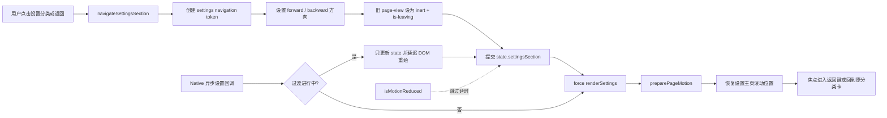
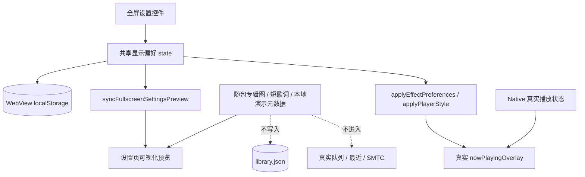

# UI、Fluent 视觉与交互规范

2026-09-09：在线搜索的300ms防抖等待属于加载阶段，不能显示已完成的空结果；取消/短输入/缺插件或配置仍结束等待。
设置首页、关于行和启动页共用Assets/AuralisIcon.png的发布投影wwwroot/assets/auralis-icon.png，
不再用CSS声波方块模拟应用图标。保持44/62 CSS px占位、透明底色和既有减少动画路径。
局域网页的独立品牌样式尚未迁移，本条不声称所有应用表面已经换图标。

2026-09-09：在线歌单详情错误页的恢复按钮明确为“刷新并返回歌单”。点击后回到同一来源的歌单列表，
清除该来源在Web内的旧歌单入口和已失败详情，重新请求通用配置，并将键盘焦点交给来源筛选按钮。
下一次配置结果显示新入口，由用户重新选择；不猜测相同标题的歌单身份、不重放过期句柄，也不触发登录或退出。
其它来源列表、账号、当前播放和已保存本地歌单保持不变。沿用页面转场/减少动画和中英翻译，无新弹窗或平台分支。

2026-09-09：在线歌单“全部”页有多个免登录来源时，使用一个默认折叠的“公开歌单来源”分组，
摘要保留来源数量和待配置/错误提示，不让每个未配置来源独占卡片。选中单一来源仍直接显示状态与操作。
缺少必填设置时提供“前往设置”（仅导航到声明式在线设置）；插件未声明设置则引导“管理插件”，不提供无效刷新。
配置完整后恢复原刷新与歌单能力。数据更新保留分组展开和summary键盘焦点，插件移除时删除对应内容。
复用原生details/summary及现有Fluent卡片，支持Enter/Space、减少动画、中英和窄窗；不更改账号、存储或Native协议。

2026-09-08：搜索/歌单行评论入口按当前 Comments 能力显示；视频入口同时需要曲目hasMusicVideo和当前VideoResolution。
全屏封面点击、扩展设置及请求使用相同配置快照，configured=false不提供可请求能力。能力消失时关闭对应评论/分P/设置面板，
取消待处理扩展、断开评论分页观察器、清除弹幕/分P缓存；迟到回复不能重开面板。准备中的视频切换会取消并回到音频，
已开始的音频/视频不因UI能力投影改变而被强制停止，返回音频仍可用；下一次请求需重新核对能力。不改变Host授权边界。

2026-09-08：平台插件页默认聚焦在线插件导入/启停/状态/重启。原有播放与传输管理卡片收进“高级组件”，
明确本地播放与媒体传输已内置，通常无需调整，不新增安装要求；仍挂载原管理器并只读请求清单，不加载实现。
原生 details/summary 支持 Enter/Space、焦点轮廓及深浅色；全局播放快捷键不得抢占 summary 的按键。
折叠状态只保留本次 Web 会话；待确认导入、错误、回退或需要重启会展开，展开后再聚焦信任控件（不预选信任）。
没有新增展开动画；保留原取消、离页、过期回复和互斥逻辑，不改变插件或底层组件选择。

2026-09-08：插件启用需重启，停用立即阻止新能力请求并尝试清理登录数据；`disablePending`显示“已停用 · 重启后释放”，
不能显示“待停用”或暗示卸载安装包。清理未完成时按插件显示名称、原因和重试按钮；其它插件操作、失败重试、刷新或离页
不抹掉当前会话的未完成提示，只有该插件清理成功的明确回复才移除。提示只驻留当前Web会话，不写账号资料或假称跨重启持久化。
重试区复用与重启区相同的响应式边距，允许长名称换行，提供包含插件名的可访问标签；导入预览或操作进行中禁止重试。

2026-09-08：平台插件的重启提示使用独立 `.plugin-restart-row`，说明左对齐卡片标题，按钮右对齐批量导入按钮。
左右使用卡片统一内边距（通常 20px、窄窗 16px），按钮距后续分隔线至少 16px；空间不足时说明与按钮分行。
不复用无内边距的导入确认按钮组，也不改变重启/信任逻辑；键盘、英文长文案和减少动画沿用原有路径。

2026-09-08 插件旧格式统一使用现有状态徽标/说明段显示“需要升级插件”，复用批量导入和重启入口，不新增平台专属页面。
说明明确保留收藏、设置和账号；旧包不呈现为可用。深浅色、中英、浏览器1/1.5/2缩放、窄窗、键盘及减少动画回归通过；非原生DPI验收。

2026-09-08：歌词加载提示使用“已启用的歌词插件”，不承诺某个网站或固定查找次序。来源/缓存名称当作转义数据展示，不按平台改名。
删除不再被当前DOM使用的平台专属徽标CSS；账号歌单错误通过通用来源模板翻译。页面布局、动画、控件不变，资源缓存键20260908-lyrics-capability-r1。

2026-09-08：播放组件卡片后新增“传输组件”，复用相同 settings-card/setting-row/switch/信任确认/重启样式，不更改播放页或全屏布局。
“本次启动传输组件”区分选择和首次懒加载，不声称浏览列表已经加载实现；明确展示下次启动选择与托管回退。
信任未预勾选，说明进程内非沙箱和媒体地址/请求头处理；摘要/名称转义，不展示秘密或本地路径。导入默认关闭，不做乐观启用。
三个管理器修改/确认互斥但 list 可以并发，避免初次请求互相锁住；相邻管理卡片状态联动刷新，取消/离页/迟到结果遵守旧规则。
.auralis-transport.zip 拖到平台导入入口时引导专用按钮；不伪称批量/拖入传输包已支持。150项传输和144项播放Web交互回归，原生升级矩阵仍待验收。

2026-09-08：插件设置末尾“播放组件”卡片复用 settings-card/setting-row/switch 与主题 token，不改播放栏或全屏布局。
分别显示当前生效组件、下次启动选择与托管回退；导入默认关闭、信任不预勾选，启用不做乐观更新。
原生单包选择、确认与取消互斥于平台导入；离页取消待确认包，拒绝迟到响应，取消错误不无限重试。
按钮/状态在窄窗口换行，摘要与插件名称转义；英文、键盘与减少动画沿用原机制，无新增自定义动效。
播放包暂不走平台批量/拖入，识别 .auralis-playback.zip 时引导专用按钮；未来统一需按 kind 分流而非同名开关。


2026-09-07 SDK：插件列表的不兼容状态与未批准/损坏分开，有文字原因和下一步提示，禁止启用而非仅改变颜色。
导入按文件报告 SDK/特性/API/schema 错误，兼容包在能力详情内显示最低 SDK 与必需特性；文本转义、窄窗口换行，复用原组件。

2026-09-07：插件批量导入有旧账号地址声明时，在确认勾选前展开访问范围；没有声明不展示此设置。
使用共享 stroke/text tokens、8px 卡片圆角，长 key/scope 自动换行，敏感值永不显示；取消可撤回未提交导入。
信任勾选明确包含旧账号访问批准。中英文、键盘与小窗口保持可达，无新增动画。

2026-09-07：删除旧平台隐藏侧栏与专用歌单页面，而非继续 display:none；所有在线详情使用 online-collection-* 共享样式。
平台名来自清单，搜索曲目的视频按钮统一为“视频 / 全屏播放器内播放视频”，不依据 provider ID 猜测打开方式。
歌单详情标题、作者保持原始用户文本，不被 UI 本地化替换。平台认证失败同步清理统一歌单页并丢弃旧响应。

2026-09-07：在线歌单将公开来源与账号来源分开。无 Authentication 时不显示账号数量、登录或断开按钮，显示来源刷新和必填配置提示；公开详情错误也不能建议重新登录。
账号型来源失效时清理已打开详情及 pending 请求；没有 PlaylistDetails 时歌单卡片不可进入详情。主题、比例、键盘和减少动画沿用统一组件。

在线设置由已启用插件的 Authentication / NativeLogin / TrackSearch 和 schema 2 settings 声明生成。
没有插件时不展示固定账号、音质、网关或默认来源；只显示空状态和管理入口。
choice 复用 Fluent 下拉框（上下/Home/End/Enter/Esc），endpoint 使用统一输入框和保存按钮；失败保留草稿并显示错误。
歌词匹配、弹幕/分 P、评论及封面视频设置同样按能力显示，不以平台名称推断。参见 PLUGIN_SETTINGS.md。

## 平台插件状态页（2026-09-06）

在线歌单、在线账号和搜索来源按 Native 提供的当前插件能力生成，不能预先展示四个平台再报“未安装”。
无歌单插件时仅显示解释和“管理插件”；新 provider ID 也使用同一歌单详情页面。
导入/启停之后显示“立即重启”，并提示当前播放会停止；管理预览/提交中禁用重启。
停用前的说明必须明确会清除该插件登录数据。清理失败保留失败提示及重试操作，不能伪称成功。

设置 → 平台插件复用 settings-card / setting-row 和原有设置页切换动画，不另造弹窗。
插件显示名、版本、平台显示名与状态分层排列；桌面状态右对齐，窄窗口移到行内第二排而不压缩文字。
加载与错误有文字提示，刷新不清空旧结果；重试按钮保留焦点。完整性通过不使用“已登录/可播放”文案。
清单文字转义并跳过自动翻译，界面说明提供中英文；徽章有边线以适配强制颜色。
每个候选右侧使用既有 Fluent 开关，键盘 Space/Enter 激活，刷新后恢复原开关焦点；按钮焦点下的 Space 不应触发全局播放暂停。
开关以 Native 保存后重新发布的清单为准，不乐观翻转；等待保存时禁用重复提交，明确显示“重启生效”。
导入使用原生文件选择器，随后在同一设置页内显示确认卡片：包信息、可选中的 SHA-256、默认未勾选的信任确认以及取消/确认按钮。
选择器支持多选；也可将 1–16 个插件包拖入应用 Web 内容区域，拖入提示不抢鼠标命中，离开、失焦、Escape 或释放后消失。
拖放只转到插件设置的批次预览，不自动安装或启用；已有预览或操作未结束时拒绝重复拖入。
批次逐项展示有效包、无效包和重复 ID，详情折叠展示能力与摘要；长列表内滚动、文件名换行，保留键盘可达的信任与取消按钮。
确认仅提交有效项，完成后逐项报告结果；全批无效时禁用信任和确认。旧 WebView2 缺少 File 桥接 API 时提示使用原生选择器。
未勾选时不能确认；失败保留包信息并要求重新勾选，成功后提示默认关闭。不能把来源/完整性检查宣传成安全沙箱。
新控件复用设置页材质、边线、间距及开关动效；减少动画和强制颜色继续走既有规则，没有新的独立弹窗或热更新。

## 工作区：统一窗口与媒体表面（未发布）

设置页关于行显示版本与构建摘要，重复启动激活原窗口，不同构建明确提示切换需先退出当前实例。
视频入口统一进入全屏内嵌页，加载区显示高对比圆环；退出为可取消 160 ms 外壳退场，
视频 canvas 与弹幕/弹层一起合成，动画/弹层/队列不再隐藏视频。减少动态效果不播放旋转或退场动画。
最近搜索在空搜索页显示，最多十条，支持键盘复用、去重与清空。评论表情失败保留原文本。
`window-surfaces.css` 是共享弹层、抽屉和页内切换控件的 token 所有者：面板 8 px、操作按钮 6 px 圆角；caption 仍保持 Windows 方形样式。
弹层在支持时使用轻度半透明模糊，减少透明/强制颜色时实色；不是原生 Mica。
外观新增可选“云母”：Native 使用 Windows 11 22621+ DWM 系统背景并保留自绘标题栏，
旧系统、失败和高对比度回退实色，不覆盖用户原有窗口材质偏好。
系统文件选择器和第三方登录网页不应用 Web 弹层样式。

系统材质的兼容依据：[Microsoft DWM_SYSTEMBACKDROP_TYPE](https://learn.microsoft.com/en-us/windows/win32/api/dwmapi/ne-dwmapi-dwm_systembackdrop_type)。
云母使用全窗口 glass 与不透明的 48 DIP `MaterialCaptionBacking` 配合；不可移除标题区遮盖，否则可能出现重复系统按钮。

> 适用版本：0.16.8 工作区（含 2026-09-06 未打包 UI 统一）
> UI 技术：本地 HTML/CSS/JavaScript + WPF 顶层窗口

本文既记录当前界面，也定义后续修改应遵守的风格和验收标准。Auralis 的目标不是复刻某个第三方播放器，
而是让本地音乐体验自然融入 Windows 11：布局克制、层级清楚、命中区域可靠、动效有因果、主题和 DPI
一致。

## 1. 界面地图

扩展入口按插件能力显示；键盘/减少动画路径见本文，视频合成规则见 [`VIDEO_COMPOSITION.md`](VIDEO_COMPOSITION.md)。
内外播放模式按钮共享四态和 SVG，不再分别控制 shuffle 与 repeat。
在线音频加载中，行首显示 22px、3px 描边圆环，副标题显示“正在准备音频…”，移开鼠标仍保持可见；
行使用 `aria-busy`。减少动态效果关闭旋转但不隐藏状态，强制颜色使用系统色。

主窗口固定包含四层：

```text
WPF 顶层窗口
└─ WebView2
   ├─ 自绘标题栏（拖动区、搜索、主题快捷键、窗口按钮）
   ├─ 左侧导航（本地页面、本地歌单、单一“在线歌单”入口、设置）
   ├─ 主内容区（按 route 替换）
   └─ 底部播放栏（当前歌曲、传输控制、进度、音量、队列等）
      ├─ 右侧播放队列层
      └─ 全屏播放层（沉浸 / 唱片与歌词）
```

主要 route：

| 页面 | 内容与状态 |
| --- | --- |
| 搜索 | 本地结果与在线 Provider 分区；在线结果只提供当前会话播放 |
| 歌曲 | 全部本地曲目、排序、当前播放状态 |
| 专辑 | 本地专辑聚合 |
| 艺术家 | 艺术家卡片、可编辑头像、键盘可激活 |
| 我喜欢的 | 本地 UI 收藏，不混入临时在线结果 |
| 最近播放 | 本地播放历史 |
| 在线歌单 | 已启用插件提供的公开/账号歌单集中展示；详情与本地曲库视觉、状态分隔 |
| 我的歌单 | 用户主动整理的本机混合歌单；本地 ID 与在线引用独立保存，不合并扫描曲库 |
| 设置 | 二级分类入口和具体设置页 |

Web 主界面支持三种语言偏好：跟随系统、简体中文和英语。跟随系统只解析为 `zh-CN` 或 `en-US`，以 Native 在
启动时确认的 Windows UI culture 为准；不要在 Web 侧自行猜测而与托盘/启动错误文本产生分歧。所有产品固定
文案、按钮、辅助说明、ARIA 标签、toast、设置、空态与错误态都应通过 `i18n.js` 目录和 `t()` 输出；曲目标题、
艺术家、歌词、文件名、用户输入和 Provider 返回内容是数据，不得翻译或误作目录 key。Native shell 只覆盖关键
启动/托盘/日志文本，独立登录窗口和其余 WPF/Windows UI 尚未全面本地化，文案或验收不得声称全应用 Native
本地化已完成。

独立 Native 界面包括桌面歌词、任务栏紧凑播放条、平台登录窗口和 MV 窗口。它们共享颜色与交互精神，
但不要硬套 Web CSS 或把它们做成悬浮网页截图。

`wwwroot/lan` 是另一个独立界面：它由用户显式开启的局域网 HTTP 端点提供给普通浏览器，不属于主 WebView
route，也不复用主页面 DOM/播放状态。它应共享 Auralis 的 Fluent 令牌、字体、圆角、命中和动效原则，但拥有
独立的响应式布局、浏览器 HTML Audio、搜索与队列。

设置页面使用 `state.settingsSection` 表达主页/二级层级。进入分类和返回主页统一经过
`navigateSettingsSection()`，不能通过先替换 DOM 再临时加 class 的方式跳过离开阶段。



完整动画模式下，旧视图先离开，再渲染并进入新视图；减少动画模式下即时提交导航，但焦点恢复和页面可达性
必须保留。Native 回调在离场阶段只能更新状态，不能替换正在执行动画的 DOM；最终提交必须校验当前 navigation token，
避免过期 timer 或异步设备/缓存结果打断过渡。

## 2. 视觉语言

### 2.1 字体

默认字体栈：

```css
"Segoe UI Variable Text", "Segoe UI", system-ui, sans-serif
```

标题可使用 `Segoe UI Variable Display`，中文回退使用 `Microsoft YaHei UI`。正文不要依赖用户未必安装的
第三方字体。

建议视觉尺寸（CSS px / WPF DIP）：

| 用途 | 尺寸 | 字重 | 说明 |
| --- | ---: | ---: | --- |
| 页面大标题 | 28–34 | 650–700 | 大屏也不要无限放大 |
| 区域标题 | 18–22 | 620–680 | 设置分组、详情标题 |
| 歌曲/主列表标题 | 14–16 | 580–650 | 允许一行截断 |
| 正文与控件 | 14 | 400–550 | 默认可读基线 |
| 辅助信息 | 12–13 | 400–500 | 仍须达到对比度要求 |
| 播放栏歌曲名 | 至少 14 | 650 | 高 DPI 下不能退化成微小文字 |
| 全屏歌词 | 默认约 28 | 活动行 650+ | 由设置可调，跟随 DPI |

有效信息不能使用禁用色。浅色主题当前令牌是 `--text: #202020`、`--text-secondary: #616161`、
`--text-tertiary: #6f6f6f`，`--text-disabled: #8a8a8a` 只用于真正不可操作的状态。普通文本目标对比度
至少 4.5:1，大文本至少 3:1。

### 2.2 颜色和层级

颜色必须经 CSS 令牌使用，不在单个组件里散落主题专用十六进制值。核心令牌包括：

- `--background` / `--background-alt`：窗口底色；
- `--surface` / `--surface-solid` / `--surface-secondary`：卡片与层；
- `--surface-hover` / `--surface-pressed`：交互反馈；
- `--text` / `--text-secondary` / `--text-tertiary` / `--text-disabled`；
- `--stroke` / `--stroke-strong`：一像素边界；
- `--accent` / `--accent-rgb` / `--accent-soft`；
- `--radius` / `--radius-large`；
- `--motion-*`、`--ease-*`、`--motion-scale`。

强调色用于当前项、主操作、焦点、进度和少量状态，不用来给大面积背景染色。错误、警告和平台品牌色
要有明确语义；品牌徽章不能替代可读的来源文字。

### 2.3 圆角、描边、阴影与材质

Fluent 并不等于“每个盒子都大圆角 + 重毛玻璃”。当前重定义后的基线约为：

- 普通卡片/行 6 px；
- 大容器、弹窗、flyout 与右侧抽屉 8 px；
- 普通按钮/输入框 6 px；历史搜索等标签使用语义化胶囊 token，不能与弹窗圆角混用；
- 圆形播放按钮和头像例外；
- 一层低对比描边；只有 flyout/队列/临时浮层使用明显阴影。

窗口 Acrylic/Mica 由 Native 与 DWM 能力决定；CSS `backdrop-filter` 是内容层效果，不是假装系统材质。
材质不可用、远程桌面或节能模式下要退化为实体 surface，文字对比度不能依赖模糊。

桌面歌词是例外产品面：始终使用浅色、高透明、可调亮度的遮罩，避免在桌面上变成厚重卡片。锁定按钮是
小型浅色控件，窗口只能有一层圆角阴影，不能出现额外矩形阴影。

### 2.4 CSS 的现有覆盖结构

`styles.css` 前半部分仍保留了早期较圆润的实现，约 1450 行起有一组 Windows Fluent 重定义；因为 CSS
源顺序，后面的选择器常常是最终值。修改现有组件时必须在 DevTools 的 Computed 面板确认最终规则，不能只
编辑第一次搜索到的声明。中长期应在不改变视觉的前提下删除重复规则并拆分文件，见 `ROADMAP.md`。

## 3. 尺寸和命中区域

### 3.1 交互尺寸

Windows 桌面鼠标可用性与触控命中需要同时兼顾：

- 高频播放控件的点击盒至少 44×44；主播放建议 48×48；
- 标题栏最小化、最大化/还原、关闭控件统一使用 46×38、无圆角（square-cornered）的 caption 按钮，视觉 glyph
  位于共同中心；关闭的 hover/pressed 使用 Windows 红色语义。它们是窗口控制而非拖动区域，键盘焦点、`aria-label`
  与 tooltip 均不可省略。
- 通用纯图标按钮点击盒至少 40×40，图标本身通常保持 16–20；
- 紧凑列表内操作若视觉仅 28–32，仍通过透明 padding 或伪元素形成至少 40 的命中区；
- 相邻图标按钮至少留 4 px 间距；
- 滑杆拇指和轨道要允许手抖，不能只有 1 px 线可点击；
- 标题栏窗口按钮按 Windows 习惯保留较宽命中区，关闭按钮 hover 使用系统危险色语义。

“视觉图标居中”和“SVG viewBox 数学居中”不是一回事。播放三角形需要约 1 px 光学校正，但校正只能施加在
图标上，不能让按钮盒本身偏移。播放/暂停切换时两个图标应共享同一中心与尺寸基线；播放栏、全屏播放器与
设置预览中的播放 glyph 都必须继承这一规则。

### 3.2 列表密度

默认 `--row-height` 为 50 px，紧凑模式 44 px。封面、两行文字和行操作必须在该高度内有稳定基线；低 DPI/
矮窗口时不要同时缩小字体和压缩行高来硬塞内容。应优先：

1. 折叠次要元数据；
2. 截断长文本；
3. 让歌单区域独立滚动；
4. 侧栏进入图标窄模式；
5. 最后才减少非关键留白。

## 4. 响应式布局与 DPI

局域网设置中的配对链接默认隐藏，只有用户主动展开或复制失败时显示为只读文本框；Tab 聚焦时全选，
可收起，离开设置分组或停止共享时隐藏。地址栏式基础 URL 不能替代带一次性 fragment 的完整链接。
配对更新后的状态回调必须刷新显示值；链接不得写入日志或持久化前端存储。剪贴板重试等待期间不得阻塞 UI。

### 4.1 坐标原则

- CSS 使用逻辑像素，WPF 使用 DIP，Win32 任务栏几何是物理像素；跨边界时必须用当前 monitor DPI 转换。
- 不缓存启动时 DPI；窗口拖到另一显示器后会收到变化并向 Web 发送 `setDpiScale`。
- 位图资源准备至少满足显示尺寸 × 当前缩放；封面、图标不要先降采样再放大。
- 使用 `devicePixelRatio` 只能辅助 Web 层，Native 定位仍以目标 HWND/monitor 的 DPI 为准。

### 4.2 当前关键断点

样式表在约 1100、1040、980、920、880、860、780、760、740、660 px 等处逐步调整。断点表达的是可用
宽度，不等于某个具体 DPI。主要行为：

- 宽窗口：完整侧栏、居中的最大内容宽度、两列/多列卡片；
- 中等窗口：缩小侧栏与间距，减少非关键列；
- ≤860：侧栏约 76 px，隐藏文本标签但保留 `aria-label`/title；
- 更窄：设置行改为上下布局，搜索/列表列进一步折叠；
- 矮窗口：侧栏保持单一在线入口，设置入口与播放栏固定可达；平台卡片和详情由主内容区滚动。

设置页面在大屏上必须居中于“侧栏以外的内容区”，并有合理 `max-width`；不能相对整个屏幕居中，也不能
无限拉宽。详情表格可用更宽上限，设置卡片建议保持可读行长。

设置卡标题中的一组操作（例如“全部重扫”和“添加文件夹”）在宽屏上必须保持同一行、同一基线和稳定间距；
只在可用宽度无法满足命中区时才可进入受控换行，不得因按钮文字长度随机错行。

### 4.3 多平台一词的边界

当前应用运行平台是 Windows x64。“多平台显示”在现阶段指不同 Windows 版本、显示器比例、DPI、输入方式、
任务栏配置和 WebView2 Runtime，而不是 macOS/Linux。不要在文档或 UI 中暗示已有跨操作系统支持。

局域网播放器是一个例外的**浏览器客户端**，不是 Auralis 桌面应用跨平台移植。它至少适配 320 px 手机宽度、
平板和宽屏浏览器；媒体格式是否可播仍由该浏览器/操作系统的 HTML Audio 解码能力决定。

## 5. 主题与强调色

### 5.1 三态主题

主题有 `system`、`light`、`dark` 三种用户意图。`system` 跟随 Windows；实际渲染始终解析为 light/dark 并
写到根元素 `data-theme`。设置页和全屏播放器使用同一 Day/Night 控件与状态源，不应出现两个互相叠加的主题
动画。

主题切换必须同步：

- 主窗口页面、侧栏、播放栏和队列；
- 沉浸全屏与唱片歌词全屏；
- 所有自定义 select/color flyout；
- WPF 窗口背景、DWM 属性、任务栏播放条；
- 仍打开的桌面歌词/登录/MV 窗口中适用的部分。

MV 虽然使用独立 Native 窗口承载视频，但其音量、输出设备、声道和缓冲必须沿用主播放器设置。主播放栏或设置页
改变音量、设备或声道时，已打开的 MV 应同步；缓冲等仅能在媒体打开时生效的参数用于下一次打开。在 MV 窗口
调节音量时，主播放栏滑块也应更新，不能让用户面对两套互相冲突的播放音效状态。

### 5.2 动画

Day/Night 切换器本身有太阳/月亮、云与星的短动画；页面主题变化使用一个全屏遮罩/扩散过渡。旧的第二套
切换动画应保持删除，不能因在设置页复制控件又被引入。

切换顺序建议：

1. 捕获触发点与旧主题；
2. 显示合成层；
3. 单次更新根主题、Native theme 和所有派生令牌；
4. 只对合成层做 transform/clip/opacity；
5. 结束后移除层，不让大面积元素分别触发昂贵 blur/repaint。

目标是在 60 Hz 设备上没有明显卡顿；不得同时动画大量 `filter: blur()` 和高分辨率背景。

## 6. 动效体系

### 6.1 原则

动效必须回答“什么从哪里来、去了哪里”：

- 页面 route：进入方向与导航层级一致；
- 队列：面板从右侧进入，歌曲卡片从右到左依次出现；
- 歌单第一次加载/登录后新增：轻微位移 + 淡入 + 小幅 stagger，不能凭空出现；
- 歌曲行进入动画只由页面进入阶段触发，稳定列表的 hover 不得重新触发行位移；序号与播放按钮占用同一个
  固定命中槽，通过短淡入/缩放交叉切换，不能用 `display` 交换造成布局跳动；
- 切歌：封面/标题/歌词在同一时间轴上过渡，不闪回空状态；
- 任务栏卡片：出现、切歌和按压使用轻量 GPU 友好动画，不能高频重建窗口；
- CD：播放时稳定旋转，暂停保留角度，切歌过渡后再继续。

典型时长令牌：fast 140 ms、standard 240 ms、emphasis 440 ms。列表 stagger 每项约 20–40 ms，并设置
总上限；100 首歌不能延迟数秒才全部可用。

### 6.2 减少动画

默认动画偏好是 `system`：当 Windows/浏览器 `prefers-reduced-motion: reduce` 时，根 `--motion-scale` 为 0。
用户可显式选择完整或减少动画。新动画必须乘以 `var(--motion-scale)` 或在 reduced media query 中关闭。

减少动画模式仍要即时表达状态，不应把 opacity 固定为 0、让弹层不可见或延迟交互。CD 自动旋转、背景漂移、
stagger 和主题扩散在 reduced 下停止；hover/pressed 可保留瞬时色彩反馈。

底部与全屏播放按钮的 play/pause SVG 必须以按钮几何中心绝对定位；只允许对 play 三角做水平视觉补偿，状态切换
不得改变纵向基线。不要把不同 glyph 的独立 `translate-y` 当作视觉微调，否则按下后会产生上下位移。

### 6.3 性能禁区

- 不在每次歌词 tick 重排整个列表；只更新活动/相邻行与 transform。
- 不在播放进度每帧写多个 layout 属性；滑杆可更新 CSS 变量。
- 不在任务栏歌词变化时销毁并重建 HWND。
- 不对超大封面实时做多个 CSS blur；优先使用预缩放背景或单层 compositor 动画。
- 不给所有歌曲永久 `will-change`；只在动画前短期启用。
- 关闭的队列不得为整座曲库保留或重建歌曲卡片；队列打开时按需生成，状态变化只在面板可见时更新。
- `setPlaybackState` 的时间校准不能每 250 ms 全量扫描歌曲行或重做稳定控件状态；播放状态不变时只更新进度和歌词。
- 全屏歌词由 `lyrics-clock.js` 在 Native 时间样本之间作纯显示插值，当前行的覆盖比例随 RAF 连续更新；不要再叠加 `clip-path` CSS transition，否则会反复追赶目标或走停。只在换行时更新全行状态与滚动，歌词 DOM 在加载时缓存。
- 插值仅在全屏层打开、页面可见、播放中且非减少动画时运行。重复时间戳不延长预测，750 ms 无有效进度后冻结并停止 RAF；新样本恢复更新。暂停、显式 seek、切歌与倍速切换重新校准；歌词偏移只改变展示时间。行级 LRC 的覆盖仍是按行时长估算，不声称有逐字时间戳。
- 文档隐藏、全屏层关闭或队列收起后，停止对应无限动画并移除不再需要的 `will-change`；恢复可见时一次性同步最终状态。
- 不在不可见页面继续运行 requestAnimationFrame/interval。

### 6.4 局域网浏览器播放器动效

局域网页使用与主应用一致的 fast/standard/emphasis 时长和 Fluent ease，但它不应模拟 WPF 窗口或把所有内容
包成重毛玻璃：

- 首次目录/搜索结果使用 7 px 以内的轻位移加淡入；stagger 只覆盖前 12 项，后续立即可用；
- 切歌只对封面和文字做一次短合成动画，不重建 `<audio>` 之外的整页，不动画大面积 blur；
- 播放、随机、循环与主题按钮保留即时 pressed/selected/focus 状态；
- `prefers-reduced-motion: reduce` 或慢刷新设备将动画/transition 缩至即时，页面隐藏时暂停剩余动画；
- 网络/配对错误使用可聚焦、可恢复的页面内卡片，不能只用 toast 或持续抖动动画。

桌面端“局域网播放器”设置卡片的运行状态属于卡片标题区的尾部状态，宽屏时固定在最右侧并与标题区垂直居中；
状态不能换行落在说明文字下方。窄屏仍需保留可读性，不得压缩或截断状态文本。

## 7. 全屏播放器

### 7.1 两种样式

| 样式 | 主视觉 | 关键行为 |
| --- | --- | --- |
| 沉浸封面 | 大封面、动态/静态背景、紧凑信息与歌词 | light/dark 都有完整配色；封面保持清晰 |
| 唱片与歌词 | 左侧歌词、右侧旋转唱片、纸张/材质感 | light/dark 同步；播放时 CD 旋转，暂停保持 |

进入全屏层不一定等于 Native F11；应用内 overlay 与 Native fullscreen state 要分别表达。退出按钮、Esc 和 F11
的行为应一致且可恢复原窗口状态。

唱片旋转只属于“唱片与歌词”模式。该模式内暂停或关闭全屏层时可以保留当前唱片角度；一旦切换到“沉浸封面”，
必须取消唱片 Web Animation 并清除残留 transform，使方形专辑图恢复正向。不能只暂停动画，否则暂停时的随机角度
会泄漏到沉浸封面，形成菱形或横倒的专辑图。

### 7.2 全屏内队列

用户在全屏点“播放队列”时队列应覆盖在全屏层内，不先退出全屏。队列具有独立 scrim、焦点顺序与关闭逻辑；
关闭后焦点回到触发按钮。歌曲 stagger 动画必须有 reduced-motion 退化和长列表上限。

### 7.3 歌词来源切换

本地歌词和在线歌词切换器只在两种来源确实可选时启用。状态包含：当前来源、可用性、加载、错误和手动覆盖。
切换不能改变播放状态，也不能清空另一来源缓存。来源文案用“本地歌词”“来源酷狗”“来源 LRCLIB”等用户语言，
不显示内部 action。

### 7.4 设置页可视化预览

全屏播放器二级设置页使用随包本地演示数据（公开分发为通用自有素材），直接显示演示封面与短歌词
片段，同步展示播放器样式、背景、封面过渡、歌词模糊/弹簧、垂直位置和沉浸式控件淡化。专辑图保持原始比例，
在预览封面框中使用受控裁切，不发起网络请求。歌词片段按媒体内容原样展示，不经过界面语言翻译。

预览只是纯静态展示投影：不加载或播放音频、不发 Native 播放 action、不进入队列，不写入收藏/最近/恢复会话，
不改变 SMTC，也不触发在线 Provider。

预览的唱片与圆形专辑图必须放在同一个 Grid 单元并共享几何中心，不能用相互独立的百分比平移或外边距模拟重合；
这样在 100%/150%/200% DPI 和不同设置页宽度下都保持同心。底部预览栏使用左右等宽的三列固定中间控制组，
进度条绝对定位在栏底且不参与列宽计算。播放 SVG 相对圆形按钮做绝对居中，仅允许向右 1 CSS px 的水平视觉补偿，
不能施加垂直位移。唱片样式执行封面切换预览时必须对唱片与封面的共同容器应用过渡，不能让二者在动画过程中短暂分心。



预览和真实全屏层共享显示偏好，但只有 Native 播放回调能改变真实播放事实。减少动画时预览仍必须立即反映最终样式，
只停止背景漂移、唱片旋转、封面切换和歌词弹簧过渡。

桌面歌词设置预览必须同步实际窗口已经实现的字号、字重、主/次颜色、阴影、对齐、遮罩亮度、动画、翻译、双行、
歌曲信息与锁定提示。尚未完整实现的逐词高亮/遮罩色不能在预览中伪装为已支持。

## 8. 队列、弹层与自定义控件

媒体扩展弹层（`media-hub.js/css`）使用 Fluent 圆角/色彩 token、40px 按钮命中区和与应用一致的滑动开关。
首次进入 220 ms、关闭 140 ms，异步更新不重放整框动画；关闭恢复触发控件焦点，减少动态效果时立即切换。
评论加载更多失败保留上下文和滚动，新建歌单异步刷新保留名称与光标。我的歌单仅新增/切换时前 12 行错峰入场。

全屏舞台不应成为可编程滚动容器：使用 `overflow: clip`，歌词独立视口才可以滚动。
歌词来源等待提示使用控件内细线脉动，不能旋转整个长边框导致越界。内嵌视频显示前需等待有限布局动画结束，
弹层/队列出现时保留合成视频画面，并由同一 Web 合成层处理遮罩；小窗口仍保留内外播放模式入口。
插件能力边界见 [`PLUGIN_SEPARATION.md`](PLUGIN_SEPARATION.md)，合成规则见 [`VIDEO_COMPOSITION.md`](VIDEO_COMPOSITION.md)。

### 共享表面约束（2026-09-06）

- 弹窗外壳 `overflow: hidden`，不预留 scrollbar gutter；只有正文区滚动，标题栏必须与内宽完全一致。
- 标题栏透明，沿用外壳材质，不再用另一块实色覆盖；默认内边距 20 px，窄窗口 16 px。
- 评论和队列宽度上限 430 px、距右侧 12 px、顶部 48 px、底部 82 px；矮窗口顶部/底部改为 40/76 px。
- 评论曲目上下文独立于正文滚动；头像 40 px，正文与点赞信息对齐，分隔线仅在文字列，不能把每条评论画成卡片。
- 普通模态遮罩可模糊；右侧抽屉只轻度压暗，不模糊整个全屏播放器；关闭遮罩与面板一起退场。
- 播放扩展行最小 72 px，开关 40×22 px、滑块 16 px，与设置页一致；辅助说明显式 12 px，禁止使用浏览器默认 small 尺寸。
- 分 P/加入歌单使用轻量选择行，新建表单独立分组；我的歌单和在线歌单使用同一套选中下划线。
- 插件原生登录按钮复用 `LoginSurfaceStyle` 的 40 DIP、6 DIP 圆角和主题/焦点/禁用状态。
  仅修改 Auralis 自有外壳，不向第三方登录网页注入样式、不更改认证链路。
- 回归脚本 `tools/Test-MediaHub.cjs` 校验标题内宽、滚动归属、开关边距、字号、SVG 关闭按钮、上下文固定及窄窗口布局。

### 8.1 队列

评论使用同方向的右侧抽屉，宽度最多 430 CSS px，顶部与底部为标题栏/播放控制预留空间。
标题固定、正文独立滚动，不再让全屏播放器整体高斯模糊；头像为 40px 圆形，失败有首字占位。
接近底部自动追加评论，不重建已读节点；失败留手动重试，关闭/重新打开都有轻量水平过渡与减少动画路径。
全屏评论跟随当前歌曲，列表评论固定在用户选择的歌曲；自动下一首保留全屏并清理旧视频、旧歌词和旧封面图像。

右侧队列是应用层 panel，不是新窗口。打开时：

- `aria-hidden=false`，可操作内容进入焦点顺序；
- scrim 拦截底层点击；
- Esc 关闭；
- 当前歌曲有文本/图标双重状态，不能只靠颜色；
- 长标题单行截断，完整值放在 title/可访问名称中。

### 8.2 Select 与颜色选择

不要使用浏览器原生 `<select>` 或 `<input type=color>` 作为最终 UI，因为 Windows/WebView 主题、圆角、DPI 与
键盘体验不一致。当前 `fluent-select-*`、`fluent-color-*` 组件应提供：

- 按钮式 trigger、明确 label/value/chevron；
- light/dark surface、stroke、shadow；
- 上下键、Home/End、Enter/Space、Esc 与外部点击；
- active descendant/选中标记；
- 不越过窗口边缘的定位；
- 40 px 以上选项命中区和可见 focus。

## 9. 可访问性

最低要求：

1. 所有操作可用键盘完成；原生 `<button>` 优先于带 click 的 `<article>`。
2. 非按钮可点击卡片若暂时无法重构，至少有 `role=button`、`tabindex=0`、可访问名称、Enter/Space 处理。
3. 内部头像编辑、更多菜单等子按钮必须阻止事件冒泡，不能误触卡片主操作。
4. 所有纯图标按钮有 `aria-label` 和 title；状态按钮用 `aria-pressed`。
5. focus-visible 清楚且不被 overflow 裁掉。
6. loading、错误、登录失效与空状态用文字说明，不能只用颜色或 toast。
7. 播放进度/音量有可访问值与键盘步进。
8. 动态列表使用克制的 live region；不要让每秒歌词变化都被屏幕阅读器播报。
9. 对比度达到 WCAG AA 基线；禁用项和装饰性文字才可使用低对比色。
10. Windows 减少动画、高对比度与文本缩放至少做手工冒烟。

## 10. 状态、空页与错误

每个异步页面至少有五态：首次加载、已有内容刷新、空、可恢复错误、不可用/需登录。不要在请求开始时把旧内容
清空成白页；保留已有内容并显示轻量刷新态。

“在线歌单”合并展示已启用且支持歌单能力的来源，顶部按发现结果动态提供“全部 / 来源名称”
筛选及真实歌单数。账号操作放在可折叠“管理平台账号”内，未连接任何账号时默认展开；部分账号过期或失败时，
折叠标题仍显示需要处理。选择单个平台时直接展示该账号行及登录、刷新、断开操作。封面网格随可用宽度自动排列，
卡片显示平台归属；它只是浏览整合，不改变本地库边界。筛选用原生按钮与 aria-pressed，重绘保留当前筛选焦点。
新增歌单轻微淡入/位移，重复状态回调不重播已有卡片动画；减少动画下即时显示。进入详情后保留返回统一页面入口。

在线歌单平台筛选只对账号与歌单内容区执行 240 ms 方向感过渡，导航不随内容位移；重复点击当前平台不重绘。
空平台也有过渡，后台同平台刷新不重播整个区域动画。新增卡片 stagger 必须使用 backwards fill，避免延迟前闪现。
搜索切换来源使用 220 ms 轻微淡入；两者均尊重减少动画。插件独立登录窗口的“重试连接 / 完成”使用圆角 40 DIP
命中框，提供 hover/pressed/keyboard-focus/disabled 状态，继承打开时主窗口的浅/深主题。状态栏显示 1/3、2/3、3/3，
成功不自动闪退，验证过程中禁用重试；具体认证阶段属于插件，不由主页面推测。凭据边界见 [`PLUGIN_CREDENTIALS.md`](PLUGIN_CREDENTIALS.md)。

平台账号不可用时：

- 当前页面显示明确说明和“登录/重新登录”主按钮；
- 在线歌单页账号状态与设置页同步失效；
- 不保留一个看似在线但无法使用的徽章；
- 刷新按钮仅用于可刷新错误，不能替代登录按钮。

快速来回点击云歌单时使用 request ID/cancellation，只渲染最后一次选择的响应。已经成功加载的详情可短期缓存，
失效会话则必须同时清除缓存与账号 UI。

## 11. UI 变更验收矩阵

每次 UI 交付至少手工验证：

| 维度 | 必测值 |
| --- | --- |
| 主题 | system/light/dark；Windows 主题在应用运行中变化 |
| DPI | 100%、150%、200%；在不同 DPI 显示器间拖动 |
| 窗口 | 最小允许尺寸、常用 1280×800、最大化、超宽屏、F11 |
| 高度 | 低高度下侧栏歌单、设置和播放栏均可达 |
| 输入 | 鼠标、Tab/Shift+Tab、Enter/Space、Esc、媒体键 |
| 动画 | system/full/reduced；系统减少动画开关 |
| 数据 | 空曲库、长标题、缺封面、数百歌曲、歌词缺失/很长 |
| 语言 | system、`zh-CN`、`en-US`；system 以中文与非中文 Windows UI culture 各检查一次，并确认动态页面/弹层更新 |
| 平台 | 插件缺失、未登录、登录失效、慢请求、取消、降级音质 |
| Windows | Explorer 重启、任务栏自动隐藏（涉及任务栏时）、关闭到托盘 |

局域网页改动还要单独验证：

- 未配对、过期/已使用链接、正常配对、session 被桌面撤销、Auralis 停止和网络切换后的重配对；
- Chromium/Edge 与至少一个移动浏览器，320/680/940/1440 px 关键宽度，触控与键盘；
- 浅色/深色/system、浏览器运行中系统主题变化、`prefers-reduced-motion`；
- 空曲库、数百首、长中英文元数据、无封面、搜索无结果、Range seek、音频解码失败和并发流受限；
- 浏览器播放不改变桌面队列、播放栏、收藏、最近、SMTC 或在线平台状态；页面/DevTools 不出现绝对路径、
  配对 token（交换后）或在线凭据。

截图应包含完整窗口、缩放比例、主题和测试场景，不用裁剪掩盖相邻布局。需要保留的视觉基线放在
`Auralis.NativeTests/artifacts`，不要把个人媒体或账号信息放入截图。

## 12. 新组件检查单

- [ ] 使用现有 token，而不是硬编码一套新主题。
- [ ] light/dark/system 三态一致。
- [ ] 视觉尺寸和命中区域分离，图标光学居中。
- [ ] hover、pressed、selected、disabled、focus-visible 都存在。
- [ ] 键盘与可访问名称完整。
- [ ] 窄、矮、大屏和 100/150/200% DPI 可用。
- [ ] full/reduced motion 都有正确结果。
- [ ] 异步 loading/empty/error/stale request 可恢复。
- [ ] 没有持续 layout thrash、无界 blur 或隐藏页面定时器。
- [ ] 若跨 Native/Web，协议文档与双方实现同提交更新。
