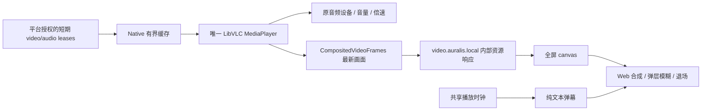

# 内嵌视频合成（0.16.8）

2026-09-07：主解码器与 CompositedVideoFrames 已移到 Auralis.Playback.LibVlc，主窗口仅调用 IPlaybackSession。
旧 SetVideoWindow(0) 已移除：输出回调由 Open(video:true) 在停止旧解码后绑定，Close/替换媒体清除旧 JPEG。
三次同一会话视频→音频→视频的真实 LibVLC 合成媒体回归通过；尚未部署 current 或验收真实账号视频 UI。

## 原因与修复

0.16.7 使用 WindowsFormsHost 的子 HWND。Web 层无法在其上绘制弹层/弹幕，旧代码在 dialog、队列和过渡时
隐藏子窗口，留下黑色占位。0.16.8 删除该子 HWND，视频仍由同一个 BundledAudioPlayer 解码，画面进入 Web 的 canvas。

## 约束

- vmem RV32、32 字节对齐，保留比例，最长边 1280。最多约 30 次/秒编码；始终只保留最新 JPEG，不积累帧队列。
- Native 资源只接受当前 track handle / requestId 的 GET；没有 HTTP listener，不接入 LAN，不返回签名媒体 URL 或请求头。
- Web 单个 fetch / bitmap 解码任务，no-store、不带 Cookie；切歌、取消或隐藏会撤销旧任务，迟到 bitmap 关闭并丢弃。
- 弹层/队列不停止画面；页面隐藏只暂停 Web 取帧，不改变音频意图。canvas object-fit contain 保留比例和黑边。
- 调用方停止/Dispose LibVLC 后才释放 callback 存储。关闭媒体清除旧 JPEG。回调不投递逐帧 Dispatcher 任务。
- Playing 不等于首帧。播放中等待实际 JPEG，20 秒无画面返回音频；暂停输入可能尚无解码帧，显示待播放说明并保留暂停。
- VLC 的 Time 属性在重开媒体后可能保留上一输入值。只有当前输入发出 TimeChanged 才使用该值，否则使用请求的起点。
- 软件缩放/编码/浏览器解码有 CPU 成本；不是零拷贝 GPU 路径，不宣称 4K/60FPS/无损或声学无缝。

## 评论、弹幕和搜索历史

`PlatformComment.Emotes` 为可选的精确文本 token + public Uri，不是 HTML。Bilibili 从 content.emote 解析最多 64 项，
仅接受 hdslb 图片域；Host 再注册到已有图片代理，前端只接受该代理 URL。最多每评论 100 张，失败用 token 替代。
减少动态时显示原文字；不假装 CSS 能停止 GIF。平台评论与用户输入都必须 HTML escape。

音频弹幕层放在全屏容器，视频时移动到视频 surface；共用已加载的当前分 P 弹幕和 LyricsClock。
切换重置行道、seek 二分重定位、暂停/时钟停滞冻结，下一首或新分 P 丢弃旧请求。

`search-history.js` 仅保存本机 `auralis:search-history`，10 条、每条最多 200 字符、忽略大小写去重并移到首位。
Enter/blur 提交，输入时的未完成字符不逐次记入；空值忽略、损坏或不可写存储不阻断搜索。

## 维护入口

窗口云母使用全客户区 glass；`MaterialCaptionBacking` 在原生根层给标题栏不透明衬底，防止 DWM 标题按钮从透明 Web 标题栏透出。
本轮实窗检查浅色/深色、最大化/还原；仍需目标系统跨屏 DPI 与高对比度回退验收。

- Native：`CompositedVideoFrames.cs`、`BundledAudioPlayer.cs`、`MainWindow.EmbeddedVideo.cs`。
- Web：`media-hub.js/css`、`search-history.js`、`app.js`。
- 回归：`tools/MediaEngineSmoke`（真实静音合成媒体）、`tools/Test-MediaHub.cjs`（浏览器）、`tools/Test-SearchHistory.cjs`。
- 仍需按目标设备验证 CPU/电量、长视频、真实音画同步、最小化/恢复和原生跨屏 DPI，不以 fixture 代替。
